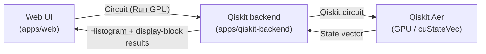

English | [日本語](README.ja.md)

# qni-webgpu

A **WebGPU-based quantum circuit editor and simulation environment** that runs in the browser.
The circuit editor is written in Rust + egui and delivered as WebAssembly; state vectors and display blocks are computed with WebGPU compute shaders.

The official successor to [Qni](https://github.com/qniapp/qni) (the WebGL-based qni-gl), it has been redesigned to keep state simulation **entirely on the GPU**.


> Example: a Grover search sample circuit. The state-vector display shows how the solution's probability amplitude grows while the others remain small.

## Features

- **Edit quantum circuits in the Web UI** — Drag gates from the palette into the circuit. Local WebGPU simulation supports up to 16 qubits; the external GPU (Qiskit) backend supports up to 32 qubits.
- **Fast local simulation with WebGPU** — State vectors, density matrices, Bloch vectors, and their displays are computed and rendered on the GPU. The production rendering path does not read data back from GPU to CPU; test-only on-demand reads are separate.
- **Display blocks** — Amplitude, probability, Bloch sphere, and density matrix display blocks are supported.
- **External GPU execution (optional Qiskit backend)** — `Run GPU` sends circuits to the HTTP API in `apps/qiskit-backend` for execution with Qiskit Aer (cuStateVec).
- **Foundation for ABCI / Open OnDemand deployment** — Docker, Singularity, and Open OnDemand definitions are included in `deploy/`.

## Quick start

The shortest path to running the Web UI locally. You need Rust (stable), Node.js 22.18 or later, and pnpm 9.

### 1. Set up Rust and Trunk

```bash
rustup target add wasm32-unknown-unknown
cargo install trunk --locked
```

### 2. Start the development server

```bash
cd apps/web
pnpm install
trunk serve --address 127.0.0.1 --port 4174 --no-autoreload
```

### 3. Open it in a browser

Open the following URL in a WebGPU-capable browser (a recent Chrome or other Chromium-based browser is recommended):

```text
http://127.0.0.1:4174/
```

From the repository root, `./scripts/open-web.sh` opens the already running Web UI. It tries `google-chrome-stable` first.

For more on startup and environment variables, see [`docs/web.md`](docs/web.md).

## Development

Run the main checks together from the repository root:

```bash
./scripts/check-all.sh
```

This runs Web Rust fmt / clippy / test / snapshot checks and a production Trunk build, Web preflight / BDD / Playwright tests, Node deployment configuration tests, a Qiskit backend installation smoke check and tests, and TUI fmt / clippy / test / snapshot / audit / deny checks. It does not include documentation linting. Beyond the quick-start prerequisites, this requires `cargo-insta`, `cargo-audit`, `cargo-deny`, Playwright Chromium and Xvfb, and Python 3.10+.

Main commands for running checks individually:

- **Web BDD (Cucumber)**: `cd apps/web && pnpm install && pnpm run test:bdd`
- **Web Playwright**: `cd apps/web && pnpm exec playwright install chromium && xvfb-run -a -s "-screen 0 1920x1080x24" pnpm exec playwright test` (requires Xvfb for `xvfb-run`)
- **Documentation lint**: `./scripts/lint-docs.sh` (terminology consistency / HTML structure / Markdown style)

See [`docs/rust.md`](docs/rust.md) and [`docs/web.md`](docs/web.md) for details.

## Qiskit backend (optional)

This is the local backend for external GPU execution invoked by `Run GPU`. The Web UI sends the circuit; the backend returns only a histogram and per-display-block results. It does not transfer the full state vector or full probability distribution.



Shortest way to start it locally (requires Python 3.10 or later):

```bash
PYTHONPATH=apps/qiskit-backend/src python3 -m qni_qiskit_backend --port 4184 --runner mock
```

There are three runners:

- `mock` — Returns a fixed histogram and display-block results. For UI and API smoke tests.
- `qiskit-cpu-dev` — An **explicit development runner** for checking the Qiskit path on a CPU. It is not a WebGPU CPU fallback.
- `qiskit-gpu` — A production-equivalent runner that requires `device="GPU"` / `cuStateVec_enable=True`. It does not fall back to the CPU.

Production deployment permits only `qiskit-gpu` and rejects requests for `mock` or `qiskit-cpu-dev`. The external backend supports up to 32 qubits, but exact amplitude display extraction is limited to 16 qubits or fewer. See [`apps/qiskit-backend/README.md`](apps/qiskit-backend/README.md) for details.

## Deployment

Definitions for Docker, Singularity, and Open OnDemand on ABCI GPU nodes are included in `deploy/`. Through Open OnDemand, `singularity run --nv` starts the application on a GPU node, providing the Web UI and `/run` API under `/node/<host>/<port>/`.

```bash
docker build -t qni-webgpu-abci .
docker run --gpus all --rm -p 8000:8000 \
  -e QNI_AUTH_USERNAME=userA \
  -e QNI_AUTH_PASSWORD=passA \
  qni-webgpu-abci
```

This example enables Basic authentication. The container also starts without credentials, so configure authentication in public environments (`QNI_REQUIRE_BASIC_AUTH=true` rejects startup without credentials).

For deployment details, see:

- [`docs/implementation/abci-deployment-guide.md`](docs/implementation/abci-deployment-guide.md) — ABCI Open OnDemand deployment guide
- [`docs/implementation/external-gpu-api-compatibility.md`](docs/implementation/external-gpu-api-compatibility.md) — External GPU API compatibility policy
- [`docs/implementation/qni-gl-migration-notes.md`](docs/implementation/qni-gl-migration-notes.md) — Differences from qni-gl

## Documentation

- [`docs/architecture.md`](docs/architecture.md) — WebGPU architecture overview
- [`docs/tech-stack.md`](docs/tech-stack.md) — Technology stack (Rust / wgpu / egui / Trunk)
- [`docs/web.md`](docs/web.md) — Starting and checking the Web app
- [`docs/rust.md`](docs/rust.md) — Rust checks
- [`docs/design.md`](docs/design.md) — UI design notes
- [`apps/qiskit-backend/README.md`](apps/qiskit-backend/README.md) — Qiskit backend API specification

## Known limitations

- **A WebGPU-capable browser is required**: The latest versions of major browsers (Chrome / Edge / Firefox / Safari) work. However, Firefox stable on Linux does not support WebGPU; you need to enable `gfx.webgpu.ignore-blocklist` in Nightly / Beta (as of May 2026). The app will not start with a GPU or driver that does not support WebGPU.
- **The Qiskit backend must be set up separately**: To use `Run GPU`, start `apps/qiskit-backend` as a separate process. The production `qiskit-gpu` runner requires CUDA / cuStateVec.
- **ABCI deployment is environment-dependent**: The definitions under `deploy/` have only been partially tested on actual ABCI infrastructure; resource types and module names must be adjusted for your environment.
